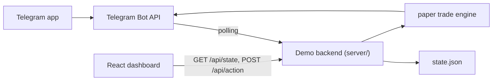

# Telegram Bot Guide — Polymarket AutoTrader (Demo)

This guide explains how to wire up the Telegram bot that controls the
**demo / paper-trading** version of the dashboard. With the bot running, you
can list strategies, pause/resume, create new ones, reset balances, and
receive live trade alerts — all from your phone, while the React dashboard
on the cloud server stays in lockstep.

> **Demo only.** No real on-chain orders. No private keys. The bot is
> intentionally restricted to paper trading.

---

## 1. What you'll set up



Three pieces:

1. **Telegram bot** created via `@BotFather`.
2. **Demo backend** (this repo's `server/` folder) running on a cloud VPS or
   any always-on host.
3. **React dashboard** that polls the same backend.

---

## 2. Create the bot in Telegram

1. Open Telegram, search for `@BotFather`, hit **Start**.
2. Send `/newbot`. Pick a name (e.g. `PolymarketAutoTrader Demo`) and a
   username ending in `bot` (e.g. `polymarket_autotrader_demo_bot`).
3. BotFather replies with an HTTP API token like
   `1234567890:ABCDefGhIjKlmnoPqRstuVwxyZ012345678`. **Copy it** — this is
   `TELEGRAM_BOT_TOKEN`.
4. Suggested extras (optional but nice):
   - `/setdescription` — "Demo paper-trading control bot"
   - `/setcommands`, paste:

     ```text
     start - Show welcome
     help - Full command list
     status - Overall PnL & counts
     balance - Wallet balances
     wallets - List wallets
     register - Set wallet password (first time)
     signin - Sign in to a wallet
     signout - Sign out
     whoami - Current session
     strategies - List strategies
     copies - List copy setups
     pause - Pause a strategy/copy by id
     resume - Resume a strategy/copy by id
     clone - Duplicate a strategy
     delete - Delete an item (with confirmation)
     newstrategy - Wizard to create a strategy
     newcopy - Wizard to create a copy setup
     tags - List tags & limits
     settag - Set tag profit/loss limit
     resumetag - Clear a tag's auto-pause
     resetdemo - Reset paper balance
     report - Reports (today / wallet)
     logs - Last events
     subscribe - Receive alerts
     unsubscribe - Stop alerts
     cancel - Cancel a wizard
     ```

---

## 3. Find your chat IDs

The bot enforces an **allowlist** of chat IDs so random people on Telegram
can't poke your demo. Each trader has their own chat id.

1. Tell each trader to message `@userinfobot` on Telegram. It replies with
   their numeric **id** (e.g. `987654321`).
2. Collect all IDs (yours + your friends').
3. Comma-join them: `987654321,123456789,456789012`.

---

## 4. Configure the server

```bash
git clone <your-fork-url> polymarket
cd polymarket
npm install
cp server/.env.example server/.env
```

Edit `server/.env`:

```env
PORT=4317
API_TOKEN=                              # optional shared bearer for /api/*
TELEGRAM_BOT_TOKEN=1234567890:ABC…       # from BotFather
TELEGRAM_ALLOWED_CHAT_IDS=987654321,123456789
```

> **Security note.** Leaving `TELEGRAM_ALLOWED_CHAT_IDS` empty makes the bot
> answer **anyone** who messages it. Always set the allowlist in production.

If your dashboard will live on a public URL and you don't want random
internet users hammering `/api/*`, also set `API_TOKEN` to a long random
string. Then build the dashboard with the same value:

```bash
echo "VITE_CLOUD_TOKEN=<same-token>" >> .env.local
echo "VITE_CLOUD_API=" >> .env.local      # leave blank for same-origin
```

---

## 5. Run it

### Local laptop (quick test)

```bash
# terminal 1 — demo backend + Telegram bot
npm run dev:server

# terminal 2 — dashboard
npm run dev:client
```

Or both at once:

```bash
npm run dev:all
```

Open `http://localhost:5173`. Header should now show a green **CLOUD** badge.
Send `/start` to your bot from Telegram. If allowlist is set correctly you'll
get the welcome message.

### Cloud VPS (24/7)

The recommended layout for a small shared cloud box:

```bash
# on the VPS
git clone <repo> /opt/polymarket
cd /opt/polymarket
npm ci
npm run build                              # produces dist/
cp server/.env.example server/.env
$EDITOR server/.env                        # fill in tokens

# run via PM2 (process manager)
sudo npm i -g pm2
pm2 start server/index.js --name pmt
pm2 save
pm2 startup                                # follow the printed instructions
```

The Express server hosts both:

- `GET /api/*` — state + action API used by the dashboard and bot
- everything else → static `dist/index.html` (the React app)

Front Nginx with HTTPS (Let's Encrypt) and proxy `/` and `/api/` to
`localhost:4317`:

```nginx
server {
    listen 80;
    server_name pmt.yourdomain.com;
    location / { proxy_pass http://127.0.0.1:4317; proxy_set_header Host $host; }
}
```

Then `sudo certbot --nginx -d pmt.yourdomain.com` for HTTPS.

---

## 6. Quick start in Telegram

```text
You:  /start
Bot:  *Polymarket AutoTrader — Demo Bot*
      …

You:  /wallets
Bot:  🆕  `w_alice`  *Trader A*  — $1000.00 · 1s / 1c
      🆕  `w_bob`    *Trader B*  — $1000.00 · 1s / 1c
      🆕  `w_chad`   *Trader C*  — $1000.00 · 1s / 1c

You:  /register w_alice mypassword123
Bot:  ✅ Registered & signed in as `w_alice`

You:  /strategies
Bot:  Strategies …

You:  /pause s_btc_sniper
Bot:  ✅ `s_btc_sniper` is now PAUSED

You:  /subscribe
Bot:  🔔 alerts ON

(seconds later)
Bot:  ✅ *ETH Scalp* ETH WON +$1.23 · Trader B
Bot:  ❌ *AlphaWhale* BTC LOST -$1.00 · Trader A
```

Open the dashboard in your browser at the same time and you'll see:

- the **CLOUD** badge stays green
- the strategy list updates within 2-3 seconds of any Telegram action
- the wallet pill shows the live demo balance ticking up/down
- the Live Log gets the same trade rows the bot is broadcasting

---

## 7. Full command reference

### Auth

| Command | Description |
| --- | --- |
| `/wallets` | List wallets and IDs |
| `/register <walletId> <password>` | First-time setup for a wallet |
| `/signin <walletId> <password>` | Switch active session |
| `/signout` | Forget the current session |
| `/whoami` | Show signed-in wallet |

### Status & reports

| Command | Description |
| --- | --- |
| `/status` | Total PnL, active counts, mode |
| `/balance` | Per-wallet paper balances |
| `/logs [n]` | Last n events (default 10, max 40) |
| `/report today` | Today PnL + win rate |
| `/report wallet <walletId>` | Wallet-specific aggregate |

### Strategies

| Command | Description |
| --- | --- |
| `/strategies` | List with IDs |
| `/pause <id>` | Pause strategy or copy-trade |
| `/resume <id>` | Resume strategy or copy-trade |
| `/clone <id>` | Duplicate (starts paused) |
| `/delete <id>` | Delete (asks for confirmation) |
| `/newstrategy` | Guided 7-step wizard |

### Copy trades

| Command | Description |
| --- | --- |
| `/copies` | List copy setups |
| `/newcopy` | Guided 6-step wizard |

### Tags

| Command | Description |
| --- | --- |
| `/tags` | List tags with profit / loss / aggregate |
| `/settag <tagId> profit <amount\|null>` | Set / clear profit target |
| `/settag <tagId> loss <amount\|null>` | Set / clear loss limit |
| `/resumetag <tagId>` | Clear an auto-pause and resume items |

### Demo balance / alerts

| Command | Description |
| --- | --- |
| `/resetdemo` | Reset signed-in wallet (asks for confirmation) |
| `/resetdemo <walletId>` | Same, explicit |
| `/resetdemo all` | Wipe every wallet's stats and balance |
| `/subscribe` | Receive trade-result alerts |
| `/unsubscribe` | Stop alerts |
| `/cancel` | Cancel any in-progress wizard |

---

## 8. Wizards

`/newstrategy` walks through label → coins → timeframe → direction → price
range → per-trade USD → total budget. Each step expects a single message;
type `/cancel` to abort. The bot replies with the new strategy ID, which you
can then `/pause`, `/resume`, `/clone`, or `/delete`.

`/newcopy` walks through label → target wallet address → coins → timeframes
→ size → budget.

Wizards are per-chat, so two traders running wizards at the same time don't
collide.

---

## 9. Alerts

`/subscribe` adds you to the broadcast list. Events that get pushed:

- `✅` / `❌` Each trade resolution (win/loss with PnL).
- `⚠️` Auto-pause when a strategy hits 80% of its budget.
- `🏷` Tag-level profit / loss trigger.

`/unsubscribe` to silence. Alerts are stored in memory; they reset when the
backend restarts.

---

## 10. Multi-trader on a shared backend

Because the dashboard and bot share `state.json`, three traders can use the
same demo at once:

- Each one **registers a password** for their own wallet via
  `/register w_alice <pwd>` (or via the dashboard's lock screen).
- Bot ownership rules are identical to the dashboard: you can only edit /
  delete / clone strategies that belong to **your** signed-in wallet.
- The wallet manager in the dashboard reflects bot changes instantly thanks
  to the 2.5s state poll.
- Reset / sign-out / change-password all flow through the same auth checks
  on the server.

---

## 11. Troubleshooting

| Symptom | Likely cause | Fix |
| --- | --- | --- |
| Header shows **LOCAL** even though server is up | Wrong port / token / blocked CORS | Open browser dev tools → Network → check `/api/health`. If 401, set `VITE_CLOUD_TOKEN`. If failed, check the server is listening on the same origin as the browser. |
| `/start` says "Sorry, this bot is restricted" | Your chat id isn't in the allowlist | Add the id printed in that message to `TELEGRAM_ALLOWED_CHAT_IDS` and restart the server. |
| Bot doesn't respond at all | Token wrong, or another instance is also polling | Make sure only **one** server has the same `TELEGRAM_BOT_TOKEN`. Telegram allows only one polling client per token. |
| Bot responds in some chats but not yours | Allowlist typo / numeric vs string | The allowlist accepts numeric ids only. Use `@userinfobot`. |
| State seems frozen | Engine stopped — backend crashed | Run `pm2 logs pmt` to see the stack trace. Restart with `pm2 restart pmt`. |
| Can't `/delete` somebody else's strategy | Not your wallet | That's by design. Sign in as the owning trader first. |
| `state.json` got huge | Logs / dailyPnl growing | The store auto-trims logs to 500 lines. To wipe everything, run `/resetdemo all`. |

---

## 12. Going further

- The bot intentionally **does not** support real-money trading. To add it
  you'd have to write a separate signing service and connect it to the
  Polymarket CLOB — see `SETUP.md` § *Going Live*. Keep that backend on a
  different host with stricter access controls.
- If you want webhooks instead of polling (slightly faster, requires public
  HTTPS endpoint), `node-telegram-bot-api` supports it; swap
  `polling: true` in `server/telegramBot.js` for a `setWebHook` call.
- All command logic lives in `server/telegramBot.js` and goes through
  `server/actions.js`, so adding new commands is just one switch case + a
  helper.
